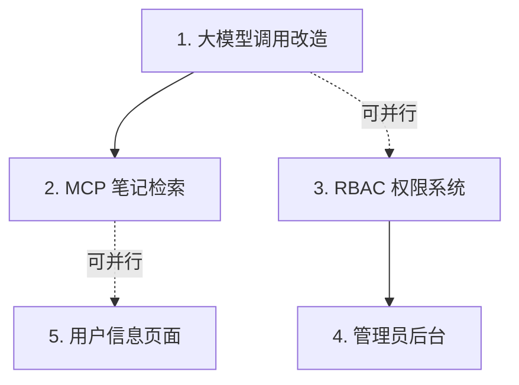

# Aura 项目开发路线图

## 项目背景

Aura 是一个基于 Ollama 本地大模型的个人笔记应用，采用 monorepo 架构（Express + React Router）。本文档规划了 5 个核心功能模块的开发顺序和排期。

---

## 功能依赖关系分析



| 功能 | 前置依赖 | 说明 |
|------|----------|------|
| 大模型配置 | 无 | 基础能力，需先完成 |
| MCP 笔记检索 | 大模型配置 | 需要 Tool Calling 支持 |
| RBAC 权限 | 无 | 独立模块，可与 1 并行 |
| 管理员后台 | RBAC 权限 | 需要权限系统支撑 |
| 用户信息页 | 无 | 独立功能，可灵活安排 |

---

## 推荐开发顺序

> [!TIP]
> 按照"基础能力优先、解除阻塞"的原则排序

### Phase 1：核心能力建设（并行进行）

| 序号 | 功能 | 预估工时 | 优先级 |
|------|------|----------|--------|
| 1 | 大模型调用改造 | 5-6 天 | 🔴 高 |
| 2 | RBAC 角色权限系统 | 5-6 天 | 🔴 高 |

### Phase 2：核心功能实现

| 序号 | 功能 | 预估工时 | 优先级 |
|------|------|----------|--------|
| 3 | MCP 笔记检索工具 | 3-4 天 | 🟡 中 |
| 4 | 用户信息页面 | 2-3 天 | 🟡 中 |

### Phase 3：管理功能

| 序号 | 功能 | 预估工时 | 优先级 |
|------|------|----------|--------|
| 5 | 管理员后台 | 6-8 天 | 🟢 普通 |

---

## 详细排期（每天 2-3 小时）

> [!IMPORTANT]
> 以下排期基于每天 2.5 小时有效开发时间估算

### 第 1-2 周：大模型调用改造

**目标**：用户可自行配置大模型，支持多种模型提供商

| 天数 | 任务 | 交付物 |
|------|------|--------|
| Day 1-2 | 设计配置数据结构、数据库表 | `model_config` 表 |
| Day 3 | 实现配置 CRUD API | 后端 endpoints |
| Day 4 | 适配 Ollama 模型调用 | 模型适配器 |
| Day 5 | 适配 OpenAI/Claude 等云模型 | 多提供商支持 |
| Day 6 | 前端配置页面 | 配置 UI |

**技术要点**：
```javascript
// server/models/model-config.js - 配置数据结构
{
  provider: 'ollama' | 'openai' | 'anthropic' | 'custom',
  baseUrl: 'http://localhost:11434',
  model: 'llama3.1:8b',
  apiKey: '加密存储',
  options: { temperature: 0.7, maxTokens: 2048 }
}
```

---

### 第 3-4 周：RBAC 角色权限系统

**目标**：实现基于角色的访问控制

| 天数 | 任务 | 交付物 |
|------|------|--------|
| Day 1 | 设计权限模型（用户-角色-权限） | 数据库设计文档 |
| Day 2 | 创建相关数据库表 | SQL 迁移脚本 |
| Day 3-4 | 实现权限中间件 | `rbacMiddleware.js` |
| Day 5 | 角色/权限 CRUD API | 后端 endpoints |
| Day 6 | 集成到现有 endpoints | 权限校验 |

**数据库设计**：
````text
user (现有)
  ↓ 多对多
role (新增)
  ↓ 多对多
permission (新增)
````

---

### 第 5 周：MCP 笔记检索工具

**目标**：大模型对话时可调用工具检索用户笔记

| 天数 | 任务 | 交付物 |
|------|------|--------|
| Day 1 | 实现 `Note.findByKeywords` 方法 | Model 方法 |
| Day 2 | 创建 MCP 工具定义和执行器 | `server/mcp/` |
| Day 3 | 修改 Chat endpoint 支持 Tool Calling | 端点改造 |
| Day 4 | 测试和优化 | 集成测试 |

**架构设计**：
```
server/
├── mcp/
│   ├── index.js          # MCP 工具管理器
│   └── tools/
│       └── search-notes.js  # 笔记搜索工具
└── endpoints/
    └── chat.js           # 调用 MCP 工具
```

---

### 第 6 周：用户信息页面

**目标**：用户可查看和编辑个人信息

| 天数 | 任务 | 交付物 |
|------|------|--------|
| Day 1 | 用户信息 API（获取/更新） | 后端 endpoints |
| Day 2 | 前端用户信息页面 | React 页面 |
| Day 3 | 修改密码、头像上传 | 完整功能 |

---

### 第 7-9 周：管理员后台

**目标**：管理员可管理用户、分配权限、查看统计

| 天数 | 任务 | 交付物 |
|------|------|--------|
| Day 1-2 | 管理后台路由和布局 | 前端框架 |
| Day 3-4 | 用户管理（列表/禁用/删除） | 用户管理模块 |
| Day 5-6 | 权限分配界面 | 角色权限管理 |
| Day 7-8 | 统计看板（用户数、笔记数等） | Dashboard |
| Day 9-10 | 操作日志（可选） | 日志模块 |

---

## 总体时间线

```
Week 1-2: 大模型调用改造 ████████████
Week 3-4: RBAC 权限系统   ████████████
Week 5:   MCP 笔记检索         ██████
Week 6:   用户信息页面             ████
Week 7-9: 管理员后台                  ██████████████

预计总工期：8-9 周（约 50-60 小时）
```

---

## 技术栈确认

| 层级 | 技术 |
|------|------|
| 后端 | Express.js + MySQL |
| 前端 | React Router 7 |
| 大模型 | Ollama (本地) / OpenAI / Anthropic (云端) |
| 认证 | JWT |
| 权限 | RBAC |

---

## 文件结构变更预览

```diff
server/
├── endpoints/
│   ├── chat.js
+   ├── model-config.js    # 模型配置
+   ├── role.js            # 角色管理
+   └── permission.js      # 权限管理
├── middlewares/
│   ├── auth.js
+   └── rbac.js            # RBAC 中间件
├── models/
│   ├── chat.js
│   ├── note.js
+   ├── model-config.js    # 模型配置模型
+   ├── role.js            # 角色模型
+   └── permission.js      # 权限模型
+├── mcp/
+│   ├── index.js          # MCP 工具管理
+│   └── tools/
+│       └── search-notes.js
+└── adapters/
+    ├── index.js          # 模型适配器入口
+    ├── ollama.js
+    ├── openai.js
+    └── anthropic.js
```

---

## 验证计划

### 自动化测试
- 使用现有的 `server/test/*.http` 文件进行 API 测试
- 为新增 endpoints 添加对应的 [.http](file:///d:/YQ_SOURCE_CODE/MY_PROJ/aura/server/test/note.http) 测试文件

### 手动验证
1. **大模型配置**：配置不同模型，验证对话功能正常
2. **MCP 工具**：在对话中提问与笔记相关的问题，验证能检索到笔记内容
3. **RBAC**：以不同角色用户登录，验证权限隔离
4. **管理后台**：管理员操作用户/权限，验证功能完整

---

## 下一步行动

> [!NOTE]
> 请确认或调整以上规划

1. 确认开发顺序是否符合你的预期
2. 选择首先开始的模块
3. 我将为选定的模块提供详细的实现计划
